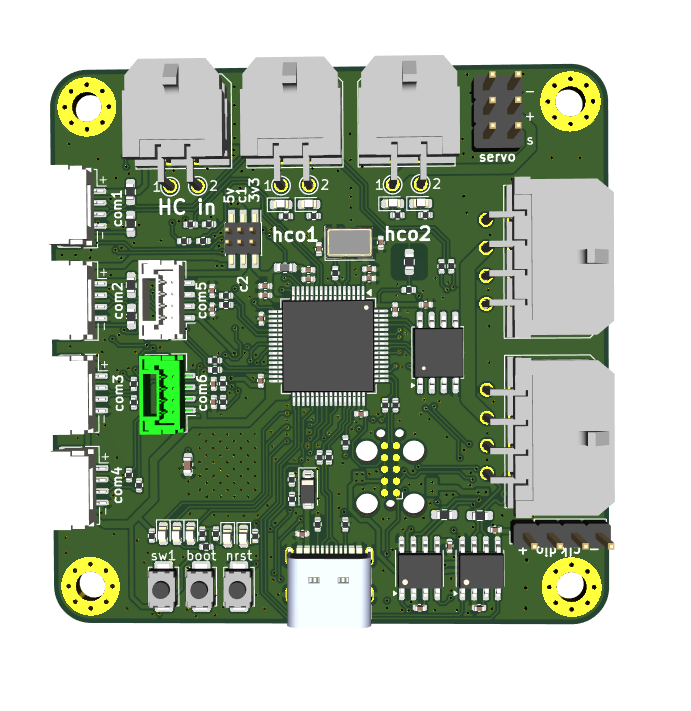

# I/O module

The I/O module is built as a general board for various sensor inputs and outputs. It is run by an STM32F103.

The module features 4 output connectors, each usable as a servo output or 2 switchable outputs, powered by one of a variety of power sources. They also feature a variety of communication ports, allowing connection to UART and I2C systems, as well as use of the STM32's ADC.

The outputs of the I/O module can be powered directly from the FC battery, a 5V line powered by a linear regulator, an external source such as the charge bus or an auxiliary battery, or an onboard, programmable boost converter.

## Components

- STM32F103
- 4x output connector
- 2x switchable outputs
- see schematics for complete list

